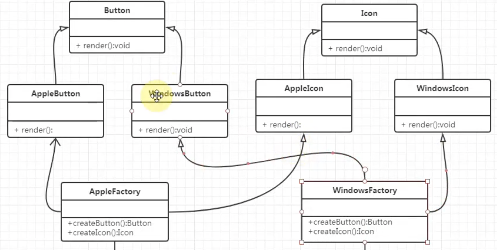

# 工厂模式

### 类图

- 类的名字
- 类的属性
- 类的方法
- 简单工厂

## 简单工厂

根据类型，来返回类的实例。

```js
class Factory {
  static create() {
    switch (type) {
      case "apple":
        return new Apple();
      case "lemon":
        return new Lemon();
    }
  }
}

const apple = Factory.create("apple");
```

- 解耦
- 隐藏具体的实现

### 经典场景

- jQuery
- React `React.createElement`

```js
class VNode {
  constructor(tagName, attr, children) {
    this.tagName = tagName;
    this.attr = attr;
    this.children = children;
  }
}

function createElement(tagName, attr, children) {
  return new VNode(tagName, attr, children);
}
```

## 工厂方法模式（多态性工厂模式）

- 多了工厂类
- 一个工厂只能创建一种产品实例
- 工厂方法模式又称多态性工厂模式
- 每个产品拥有一个单独的工厂
- 在工厂方法中，核心的工厂类不再负责创建所有的产品的创建，而是将具体创建的工作交给子类去做。

```js
class Plant {
  constructor(name) {
    this.name = name;
  }
}
class Apple extends Plant {
  constructor(name, flavor) {
    super(name);
    this.flavor = flavor;
  }
}

class Lemon {
  constructor(name) {
    super(name);
  }
}

interface Factory {
  create: () => void;
}

class AppleFactory implements Factory {
  static create() {
    return new Apple("Apple", "Sweet");
  }
}

class LemonFactory implements Factory {
  static create() {
    return new Lemon("Factory");
  }
}

const apple = new AppleFactory.create();
```

## 抽象工厂模式

一个工厂可以创建多种产品。

复杂的场景，一个工厂可能负责多个功能。

```ts
Factory;
interface IFactory {
  createButton: () => void;
  createIcon: () => void;
}

// AppleFactory.createButton;
// WindowsFactory.createButton;
```


